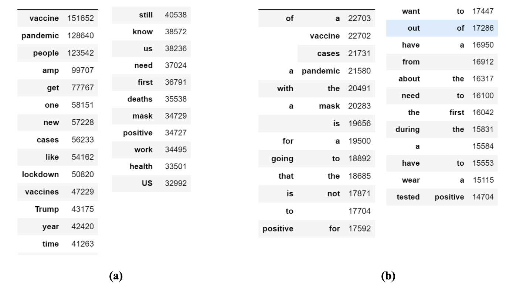
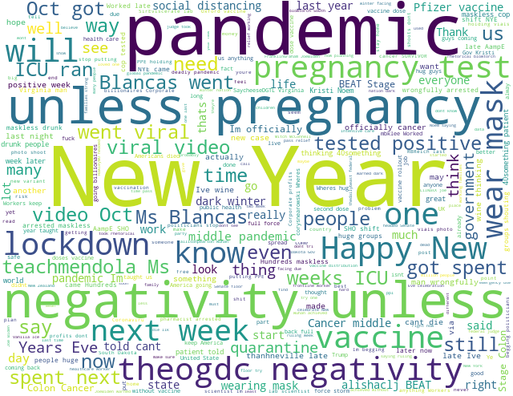

## Change of Covid Sentiment Overtime: An Analysis of Prominent Words Present In Covid Tweets

Viswesh Uppalapati, Skylar Wang

### Introduction and Context

People are highly opinionated beings and the power of social media to influence public opinion is an important area of study. We often have strong opinions of some topics and malleable ones of others, however, there is always room for change. Many external experiences, events, or factors can have an influence on opinion. One such factor is the intake of information from the different social media platforms that exist today. The existence of opinionated messages about any topic all over the internet and the ease of its accessibility can result in a shift in public opinion over time.

The Covid-19 pandemic has been a daily occurrence in recent years of our life. A global pandemic is often commonly talked about in current events and social media. Although people may have polarizing opinions on the topic, there is always a shift in sentiment over time based on the things that are happening around the world. In this study, we will analyze the Covid-19 related tweets from the beginning of the pandemic to the present day to characterize each month by the most prominent words that are present in the sample of tweets from that month. In doing so, we expect to create an interactive visual representation of the change in prominent words that characterized each month. In addition, any major shift in prominent words could be linked to that of an external event around that time in current events that will be reported along with the visualization. In doing so, we can better understand the shift in public opinion towards the pandemic over time. In addition, some commonly occurring characterizing words will be used in sentiment analysis to see the change in sentiment of the topic over time.

### Methods and Data

#### Dataset and Data Collection 

The dataset we used and sampled from was shared by Rabindra Lamsal on IEEE DataPort [3]. IEEE DataPort is a globally accessible data platform that allows storing and sharing datasets. The dataset includes CSV files that contain ID and sentiment scores of the tweets related to the COVID-19 pandemic. Lamsal collected coronavirus-related tweets using 90+ different keywords and hashtags that are commonly used while referencing the pandemic. The dataset dates from October 01, 2019, to the present. Due to the re-design of the dataset on March 20, 2020 in compliance with Twitter’s content redistribution policy and our goal of doing monthly analysis, we decided to limit our samples of tweets from May 1, 2020 to February 1, 2022. From this interval in time, we sampled 100,000 from the first day of each month. This was because of the limitations of downloading the tweet_id files that were split between each day. Due to the layout of the website, we were only able to manually download the ids for the days. As a result, the data consists of 100,000 sampled tweets from the beginning of each month during the aforementioned timespan. The dataset contains a total of 2,200,000 tweets which are collected globally, but include only those tweeted in english.

Upon acquiring the tweet IDs from IEEE DataPort, we had to get the actual content of the tweet. In order to do so, we used twarc. Twarc is a command line tool and Python library for collecting and archivingTwitter JSON data via the Twitter API. We take each of the sampled tweet ids from the dataset and hydrate those tweet ids in order to get the content of the tweets. These tweets are collected in batches at a time and are hydrated in the form of JSON dictionaries containing all the possible information about each tweet.

#### Data Processing and Exploratory Data Analysis 

To begin, the JSON format that results from hydrating a tweet using Twitter’s API comes in a pre-cleaned format. Therefore, the only cleaning and processing that was needed for our particular purpose was to clean the actual text content of the data. Each tweet was cleaned to remove any URLs and emojis. Since different forms of the word “Covid” or “Covid 19” always occur very frequently in tweets relating to the pandemic, such occurrences were removed from tweets in order to give a better representation of the descriptive words that characterize each month.

Out of the total hydrated tweets dataset of 2.2 million tweets, we found that around 24.92% are missing or were unable to be hydrated due to various reasons such as account termination, tweet deletion, and others. In addition, around 27% of the tweets contained URLs that needed to be cleaned so that they don’t interfere with the sentiment analysis done in this project.

#### Figure 1. Most Popular Unigrams and bigrams in Data

To look at the most prominent words that characterize the pandemic as a whole, we decided to look at the most popular unigrams and bigrams that exist in all of the data. To give a good representation of this, all stop words from the English language were removed for the unigrams, but not for the bigrams. This is because some of the common words in the English language can be coupled with other important words in the tweets. In part (a) we see the 25 most popular unigrams across all tweets by count. Some of the words such as “vaccine”, “lockdown”, “pandemic”, or “Trump” have come to be very frequent in the tweets across the pandemic. In part (b) the 25 most prominent bigrams are listed, which are less descriptive than the bigrams due to the inclusion of the common stop words that exist in daily language. One interesting thing to note, however, is that “tested positive” ended up being a popular bigram in the tweets. Recreating this study will result in slightly different results as the sample of tweets may differ from one experiment to another.

#### Finding Most Prominent Words Across Time

To display the most prominent words for each month of data, a Python package called wordcloud was used. It is an open-source Python package that takes in an input text to vectorize and weight the different words before generating a word cloud visualization out of it. Word clouds were used for this purpose as this seemed like the most efficient and direct way to show the different words that were popular among the tweets of each month. This way, the visualization is simple and easy to understand. In addition to finding the most prominent words across each month this way, we compiled a list of important current events that occurred in the month leading up to see whether any of them explain the frequency of certain words in the word cloud.

#### Sentiment Analysis of Few Prominent Words

Another area of analysis using the most commonly occurring words across the dataset is to analyze their change in sentiment over time. Certain words such as “lockdown”, “mask”, “Trump”, “Delta”, and “Omicron” were used to filter the tweets of each month. Tweets were sampled repeatedly till 1000 tweets containing each keyword were collected in order to perform sentiment analysis. This was done using Hugging Face, a platform that provides open-source access to common NLP practices [1]. Specifically, we employed the RoBERTa Twitter Sentiment analysis tool, which is a model trained on around 58 million tweets to perform sentiment analysis on Twitter data. The model outputs the proportion of positive, neutral, and negative words present in a certain tweet [1].

For the purposes of this project, each key-word that was chosen was used to filter the tweets and the sample of 1000 tweets taken from these filtered tweets are passed to the RoBERTa model in order to generate results. The small size of input is due to the computational and time constraints that result from using a sentiment analysis tool such as RoBERTa on a large dataset.

Lastly, the tweet Ids that were collected from IEEE Dataport are accompanied by a sentiment analysis score that was not used or considered in this project. This is because the sentiment scores contained in the dataset after March 20, 2020 were computed using the TextBlob’s Sentiment Analysis module [3]. TextBlob’s sentiment analysis model computes the sentiment polarity as a continuous value where the sentiment scores are defined in the range [-1,+1]. A tweet is considered to have a Positive sentiment if its score falls between (0,+1], a Negative sentiment if its score is in the range [-1,0), and Neutral sentiment if its score is 0. The sentiment is considered stronger if the score’s absolute value is closer to 1. We used a model that was suggested to us by our mentor Professor Justin Eldridge and is specific to Twitter. In addition, the inclusion of the different proportions in the result of the RoBERTa model seemed better for the analysis we pursue in this report.

### Results and Discussion

Upon generating the word clouds of each of the months, it was clear that the descriptive words that characterized each of the months often changed from one month to the next. For example, consider the word cloud generated in figure 3 of the tweets collected on January 1st, 2021. In the weeks leading up to this, the FDA had authorized the two vaccines Pfizer and Moderna for emergency use authorization [4]. As a result, there is an increase in topics of cancer, pregnancies, vaccines and other health related issues. This may be attributed to increased discussions about the potential side effects of the vaccine or just an overall negative reaction toward the vaccine. Similarly, each of the word clouds for the 22 months in the timespan are quite different, speaking to the fleeting nature of human attention. The major words or topics that arise in the tweets of each month are different as current events change around the world. As a result, the progression of the opinion and the topics regarding covid follow the trend seen in these word clouds. 

For a better look at each of the word clouds and the major events leading up to the time of each of the word clouds, visit the following website: https://skylarmwang.github.io/wordcloud/ [5]. The website contains each of the word clouds for the 22 months. Each is labeled by the month and date and each has a list of prominent events that potentially help explain the trend of Covid discussion as seen in the word clouds. The list of current events are compiled from Covid-19 Pandemic Timeline Fast Fact, a blogpost on CNN [4].

#### Figure 2. Word Cloud Generated for January, 2021

Upon generating the word clouds of each of the months, it was clear that the descriptive words that characterized each of the months often changed from one month to the next. For example, consider the word cloud generated in figure 3 of the tweets collected on January 1st, 2021. In the weeks leading up to this, the FDA had authorized the two vaccines Pfizer and Moderna for emergency use authorization [4]. As a result, there is an increase in topics of cancer, pregnancies, vaccines and other health related issues. This may be attributed to increased discussions about the potential side effects of the vaccine or just an overall negative reaction toward the vaccine. Similarly, each of the word clouds for the 22 months in the timespan are quite different, speaking to the fleeting nature of human attention. The major words or topics that arise in the tweets of each month are different as current events change around the world. As a result, the progression of the opinion and the topics regarding covid follow the trend seen in these word clouds. 

For a better look at each of the word clouds and the major events leading up to the time of each of the word clouds, visit the following [website](https://skylarmwang.github.io/wordcloud/) [5]. The website contains each of the word clouds for the 22 months. Each is labeled by the month and date and each has a list of prominent events that potentially help explain the trend of Covid discussion as seen in the word clouds. The list of current events are compiled from Covid-19 Pandemic Timeline Fast Fact, a blogpost on CNN [4].

#### Figure 3. Change of Sentiment Over Time For Prominent Keywords in Tweets

Out of all the words that were tweeted over the Covid-19 pandemic, we decided to choose five words that were consistently prominent during the course of the pandemic and were important conversation topics throughout the course of the pandemic. The five words we chose are “delta” , “lockdown”, “mask”, “Trump”, and “ vaccine”. These words were topics of controversial discussion throughout the pandemic. As a result, they are used for this sentiment analysis to see how it changed over time.

Tweets that were filtered by “lockdown” and “mask” tended to stay relatively consistent in sentiment across the span of the 22 months. The tweets containing “mask”, for an instance, mainly have negative and neutral sentiment in the text analysis. In addition, this proportion of negativity tends to stay consistent over time. The trend can also be seen in the tweets categorized by “lockdown”. The tweets that were more fluctuating in their sentiment were the ones filtered by “vaccine”, “Trump”, and “delta”. The overall sentiment about the vaccine generally increased in negativity over time. This might be attributed to the reduced talk of the vaccine at the beginning of the pandemic followed by negative opinion over time as vaccines were manufactured and approved for public use. As a result, the vaccine related tweets seem to have  become increasingly negative over time. Although the neutral and negative sentiment in Trump-related tweets were fluctuating, the positive sentiment seemed to have been consistent over time. Lastly, the sentiment of the Delta-related tweets is the most varied out of all. This large variation in the Delta-related tweets could be attributed to the later discovery of the delta-variant of Covid.

### Acknowledgments

Thanks to Justin Eldridge and Aaron Fraenkel of the Halıcıoğlu Data Science Institute for supporting the pursuit of this project. They provided us with the tools and resources necessary to complete the project. We also want to thank Twitter for providing data through their API and IEEE DataPort for the gathered Tweet IDs for all tweets related to COVID-19.

### References

1) https://huggingface.co/cardiffnlp/twitter-roberta-base-sentiment?text=I+like+you.+I+love+you

2) https://huggingface.co/

3) https://ieee-dataport.org/open-access/coronavirus-covid-19-tweets-dataset

4) https://www.cnn.com/2021/08/09/health/covid-19-pandemic-timeline-fast-facts/index.html

5) Word Cloud: https://skylarmwang.github.io/wordcloud/

6) Website: https://skylarmwang.github.io/DSC180B/
